All examples ported so far. 
All examples have been tested with Euphoria 4.1 64-bit and Phix 1.0.6 64-bit, although Phix for Windows is the intended target. Using the wrapper (binding) raylib64.e available here.
32-bit and Linux are not supported.

If you need 32-bit support, you can use the more comprehensive wrapper by Icy_Viking for Euphoria 4.1 (https://github.com/gAndy50/libffi-euphoria). Some examples work directly with this wrapper, while others need to be adapted. This wrapper supports Linux/Windows 32/64-bit.

### category: core [xx]

Examples using raylib [core](../src/rcore.c) module platform functionality: window creation, inputs, drawing modes and system functionality.

|  example  | image  | difficulty level | version created | last version updated | original developer |
|-----------|--------|:-------------------:|:------------------:|:-----------------------:|:----------------------|
| [core_basic_window](core/core_basic_window.ex) | 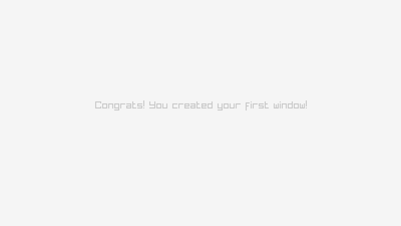 | ⭐☆☆☆ | 1.0 | 1.0 | [Ramon Santamaria](https://github.com/raysan5) |
| [core_delta_time](core/core_delta_time.ex) | 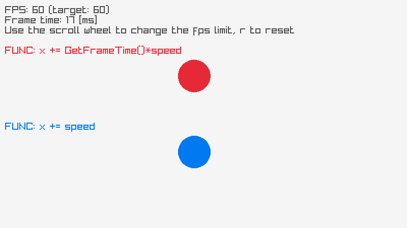 | ⭐☆☆☆ | 5.5 | 5.6-dev | [Robin](https://github.com/RobinsAviary) |
| [core_input_keys](core/core_input_keys.ex) | 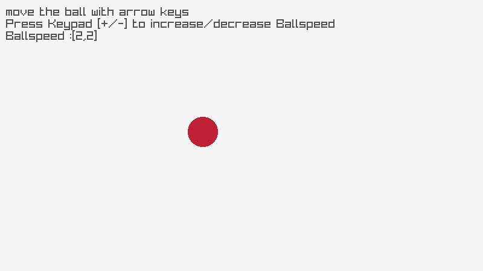 | ⭐☆☆☆ | 1.0 | 1.0 | [Ramon Santamaria](https://github.com/raysan5) |
| [core_input_mouse](core/core_input_mouse.ex) | 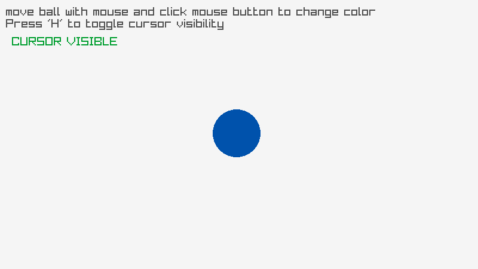 | ⭐☆☆☆ | 1.0 | 5.5 | [Ramon Santamaria](https://github.com/raysan5) |
| [core_input_mouse_wheel](core/core_input_mouse_wheel.ex) | 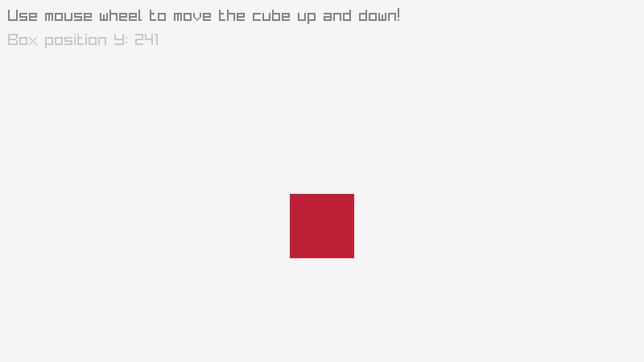 | ⭐☆☆☆ | 1.1 | 1.3 | [Ramon Santamaria](https://github.com/raysan5) |
| [core_2d_camera](core/core_2d_camera.ex) | 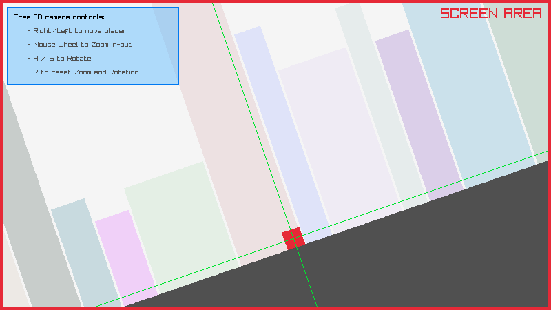 | ⭐⭐☆☆ | 1.5 | 3.0 | [Ramon Santamaria](https://github.com/raysan5) |
| [core_2d_camera_mouse_zoom](core/core_2d_camera_mouse_zoom.ex) | 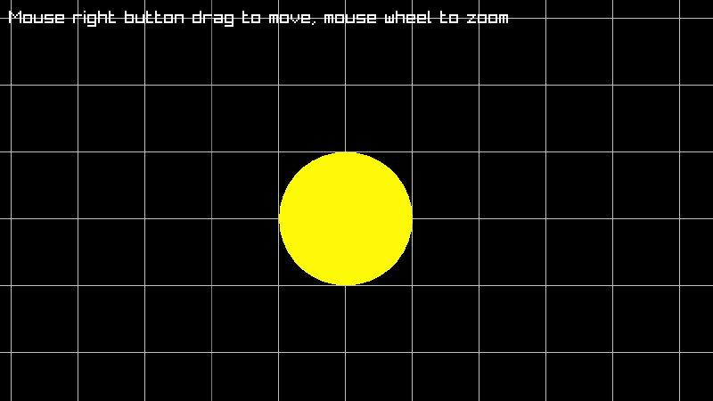 | ⭐⭐☆☆ | 4.2 | 4.2 | [Jeffery Myers](https://github.com/JeffM2501) |
| [core_3d_camera_mode](core/core_3d_camera_mode.ex) | 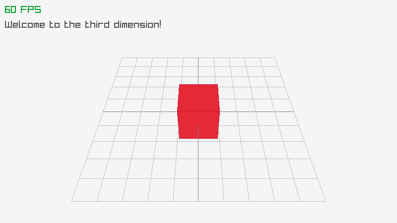 | ⭐☆☆☆ | 1.0 | 1.0 | [Ramon Santamaria](https://github.com/raysan5) |
| [core_3d_camera_free](core/core_3d_camera_free.ex) | 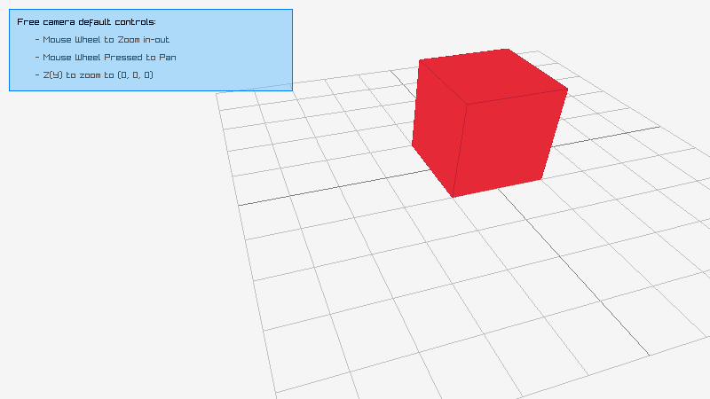 | ⭐☆☆☆ | 1.3 | 1.3 | [Ramon Santamaria](https://github.com/raysan5) |
| [core_3d_camera_first_person](core/core_3d_camera_first_person.ex) | 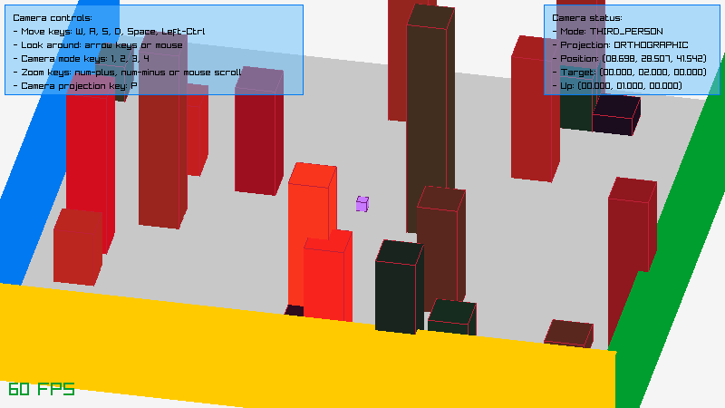 | ⭐⭐☆☆ | 1.3 | 1.3 | [Ramon Santamaria](https://github.com/raysan5) |
| [core_3d_camera_fps](core/core_3d_camera_fps.ex) | 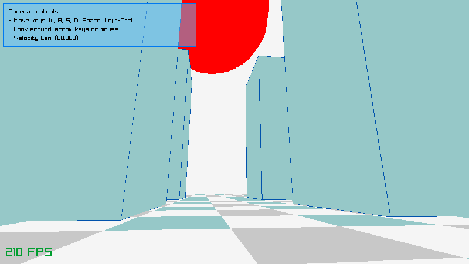 | ⭐⭐⭐☆ | 5.5 | 5.5 | [Agnis Aldiņš](https://github.com/nezvers) |
| [core_window_flags](core/core_window_flags.ex) | 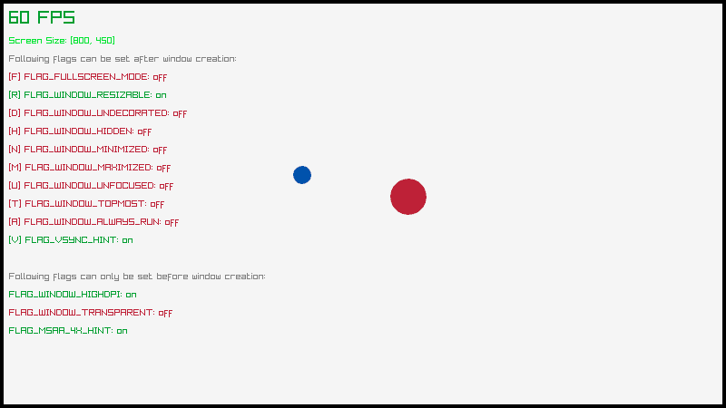 | ⭐⭐⭐☆ | 3.5 | 3.5 | [Ramon Santamaria](https://github.com/raysan5) |
| [core_render_texture](core/core_render_texture.ex) | 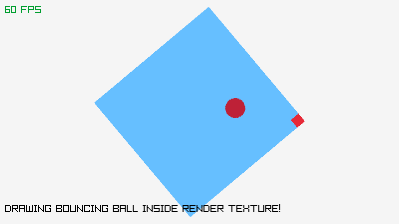 | ⭐☆☆☆ | 5.6-dev | 5.6-dev | [Ramon Santamaria](https://github.com/raysan5) |
| [core_basic_screen_manager](core/core_basic_screen_manager.ex) | 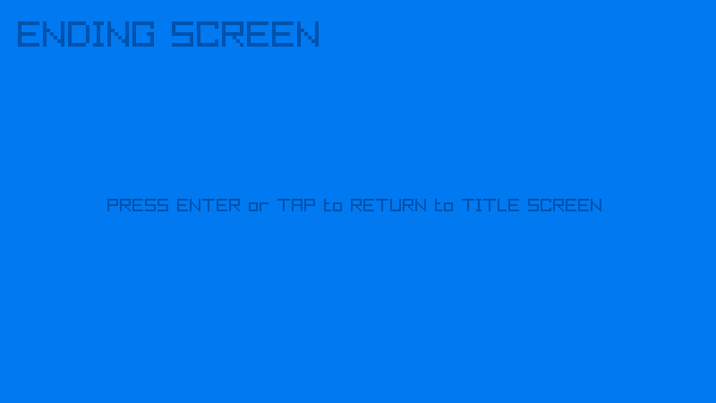 | ⭐☆☆☆ | 4.0 | 4.0 | [Ramon Santamaria](https://github.com/raysan5) |
### category: shapes [xx]

Examples using raylib shapes drawing functionality, provided by raylib [shapes](../src/rshapes.c) module.
|  example  | image  | difficulty level | version created | last version updated | original developer |
|-----------|--------|:-------------------:|:------------------:|:-----------------------:|:----------------------|
| [shapes_basic_shapes](shapes/shapes_basic_shapes.ex) | 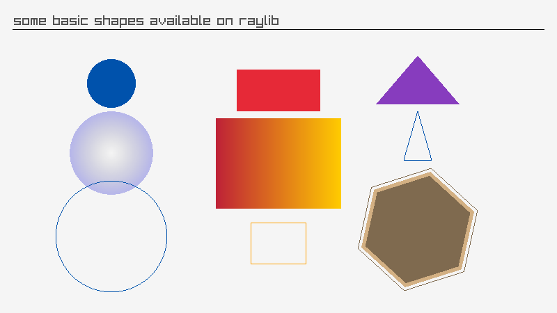 | ⭐☆☆☆ | 1.0 | 4.2 | [Ramon Santamaria](https://github.com/raysan5) |
| [shapes_bouncing_ball](shapes/shapes_bouncing_ball.ex) | 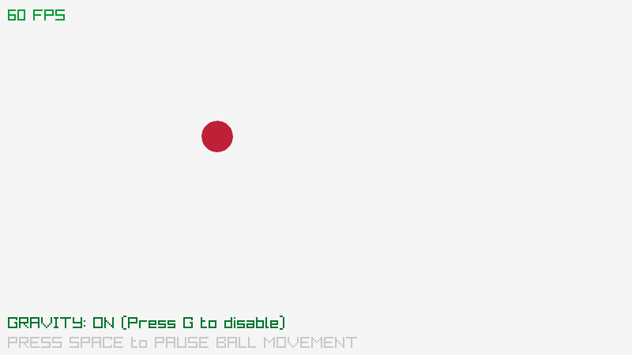 | ⭐☆☆☆ | 2.5 | 2.5 | [Ramon Santamaria](https://github.com/raysan5) |
| [shapes_colors_palette](shapes/shapes_colors_palette.ex) | 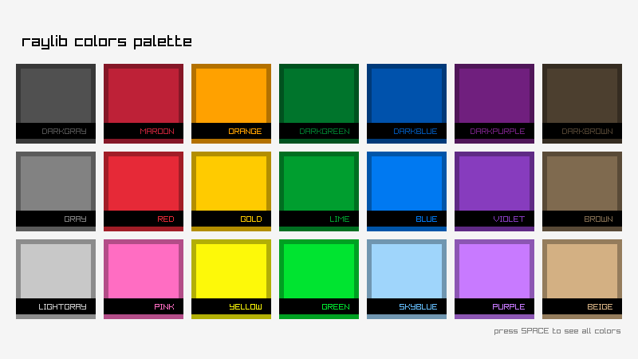 | ⭐⭐☆☆ | 1.0 | 2.5 | [Ramon Santamaria](https://github.com/raysan5) |
| [shapes_logo_raylib](shapes/shapes_logo_raylib.ex) | 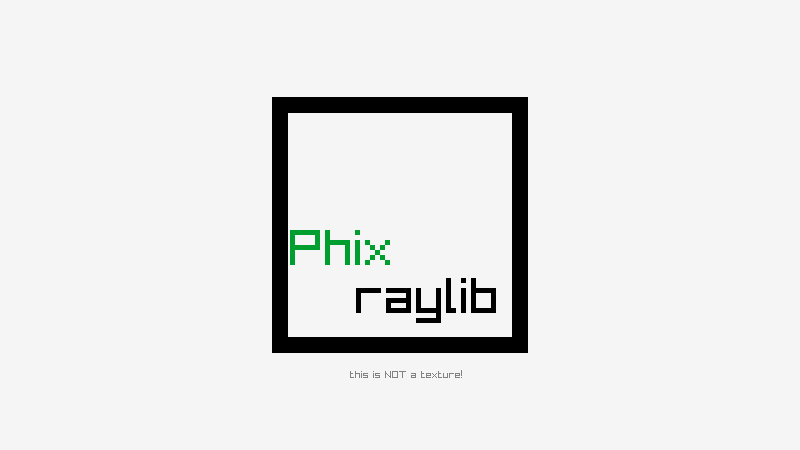 | ⭐☆☆☆ | 1.0 | 1.0 | [Ramon Santamaria](https://github.com/raysan5) |
| [shapes_lines_bezier](shapes/shapes_lines_bezier.ex) | 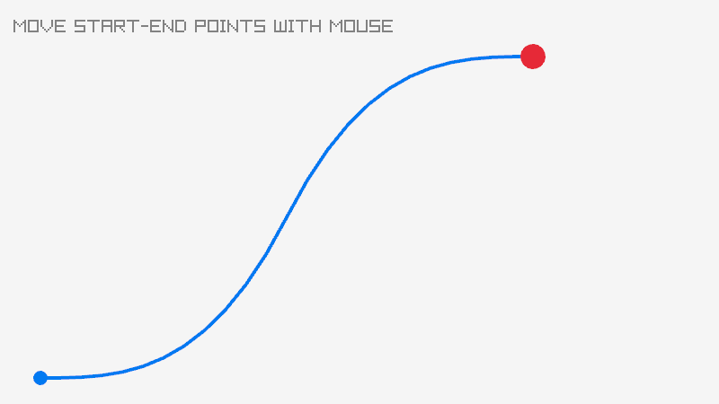 | ⭐☆☆☆ | 1.7 | 1.7 | [Ramon Santamaria](https://github.com/raysan5) |
| [shapes_collision_area](shapes/shapes_collision_area.ex) | 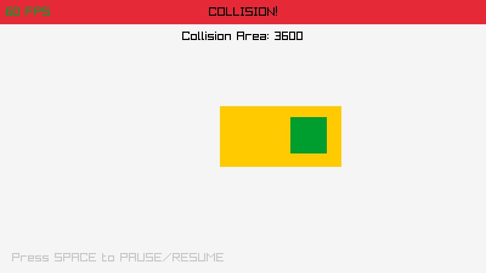 | ⭐⭐☆☆ | 2.5 | 2.5 | [Ramon Santamaria](https://github.com/raysan5) |
| [shapes_following_eyes](shapes/shapes_following_eyes.ex) | 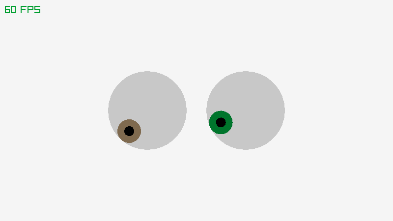 | ⭐⭐☆☆ | 2.5 | 2.5 | [Ramon Santamaria](https://github.com/raysan5) |
| [shapes_easings_ball](shapes/shapes_easings_ball.ex) |  | ⭐⭐☆☆ | 2.5 | 2.5 | [Ramon Santamaria](https://github.com/raysan5) |
| [shapes_easings_box](shapes/shapes_easings_box.ex) | 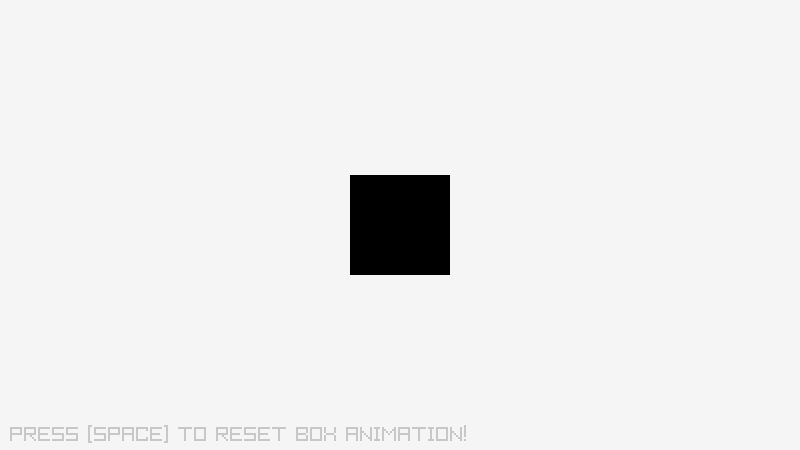 | ⭐⭐☆☆ | 2.5 | 2.5 | [Ramon Santamaria](https://github.com/raysan5) |
| [shapes_easings_rectangles](shapes/shapes_easings_rectangles.ex) | 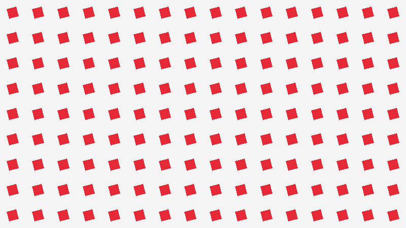 | ⭐⭐⭐☆ | 2.0 | 2.5 | [Ramon Santamaria](https://github.com/raysan5) |
| [shapes_easings_testbed](shapes/shapes_easings_testbed.ex) | 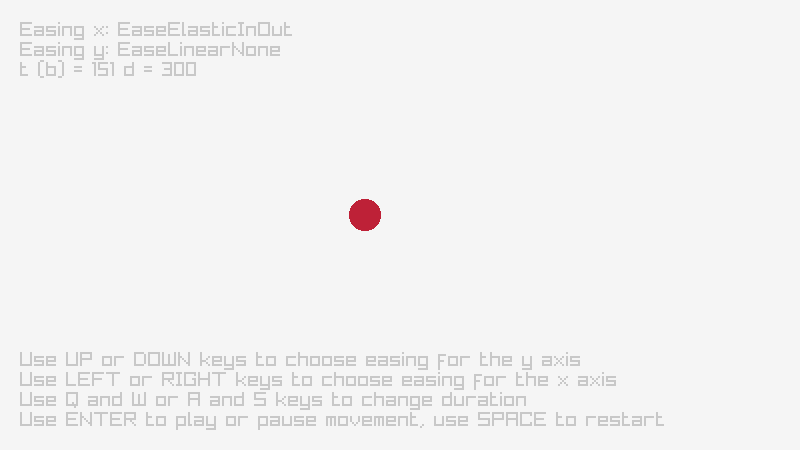 | ⭐⭐⭐☆ | 2.5 | 2.5 | [Juan Miguel López](https://github.com/flashback-fx) |
| [shapes_circle_sector_drawing](shapes/shapes_circle_sector_drawing.ex) | 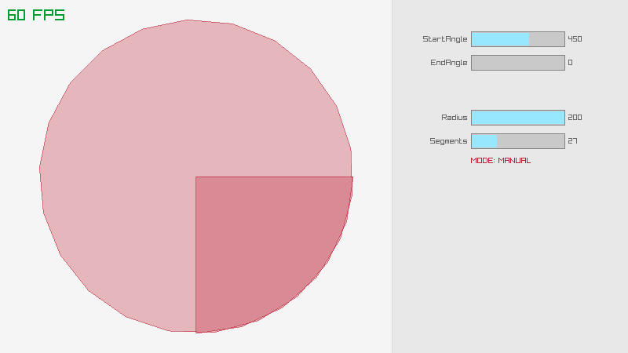 | ⭐⭐⭐☆ | 2.5 | 2.5 | [Vlad Adrian](https://github.com/demizdor) |
| [shapes_rounded_rectangle_drawing](shapes/shapes_rounded_rectangle_drawing.ex) | 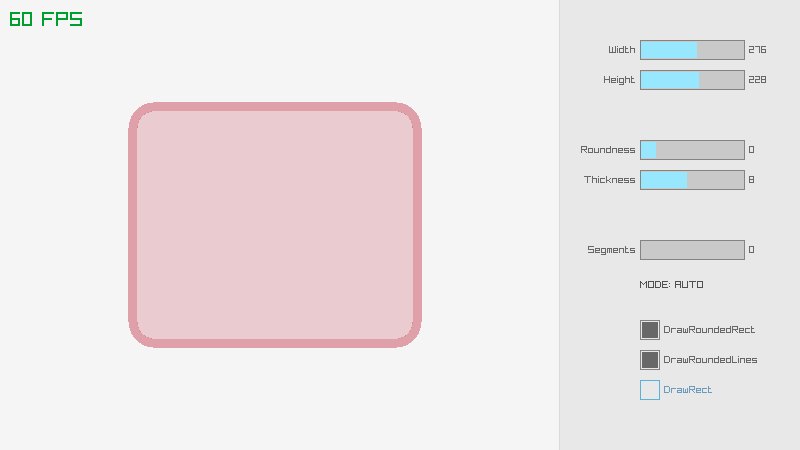 | ⭐⭐⭐☆ | 2.5 | 2.5 | [Vlad Adrian](https://github.com/demizdor) |
| [shapes_double_pendulum](shapes/shapes_double_pendulum.ex) | 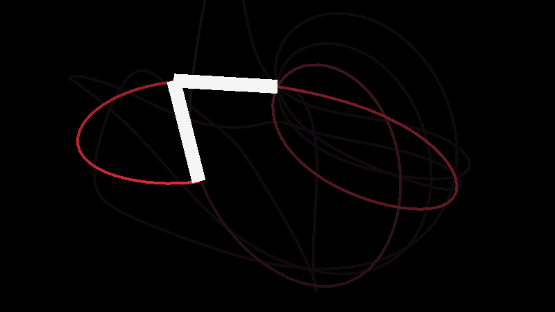 | ⭐⭐☆☆ | 5.5 | 5.5 | [JoeCheong](https://github.com/Joecheong2006) |
| [shapes_math_sine_cosine](shapes/shapes_math_sine_cosine.ex) | 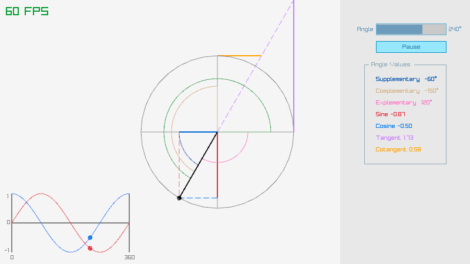 | ⭐⭐☆☆ | 5.6-dev | 5.6-dev | [Jopestpe](https://github.com/jopestpe) |
| [shapes_mouse_trail](shapes/shapes_mouse_trail.ex) | 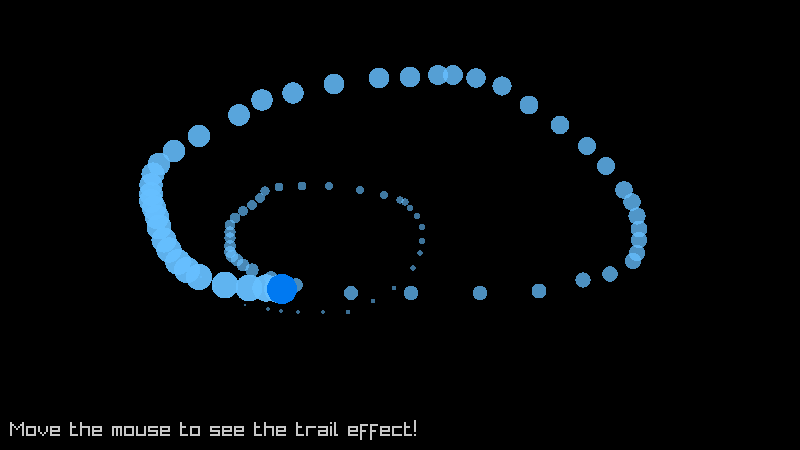 | ⭐☆☆☆ | 5.6 | 5.6-dev | [Balamurugan R](https://github.com/Bala050814) |
| [shapes_starfield_effect](shapes/shapes_starfield_effect.ex) | 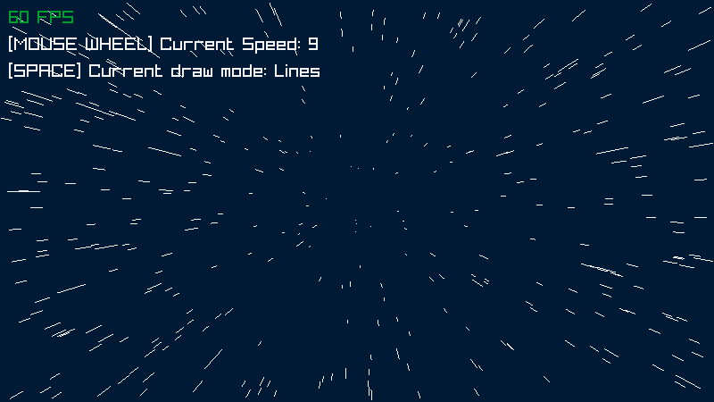 | ⭐⭐☆☆ | 5.5 | 5.6-dev | [JP Mortiboys](https://github.com/themushroompirates) |
| [shapes_ball_physics](shapes/shapes_ball_physics.ex) | 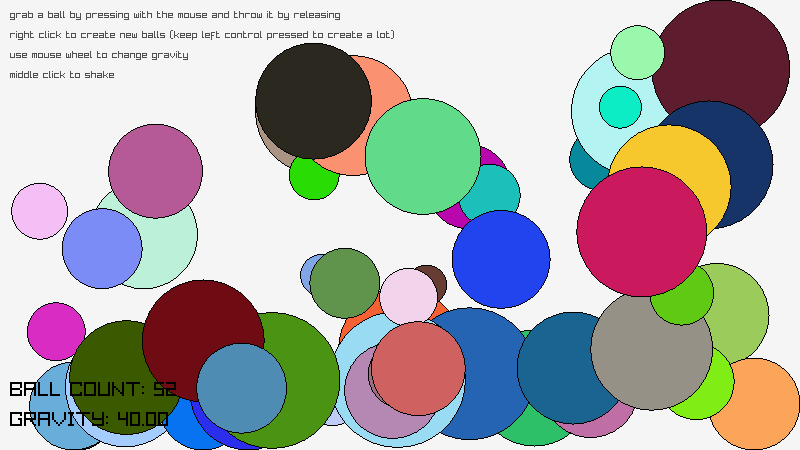 | ⭐⭐☆☆ | 5.6-dev | 5.6-dev | [David Buzatto](https://github.com/davidbuzatto) |
| [shapes_triangle_strip](shapes/shapes_triangle_strip.ex) | 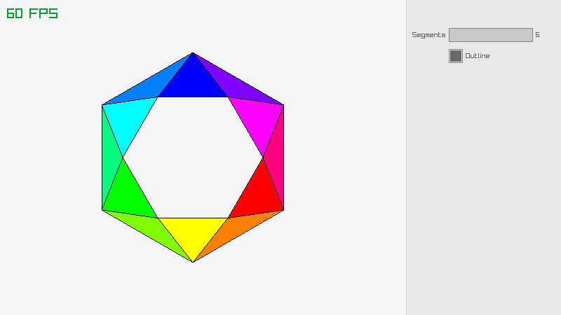 | ⭐⭐☆☆ | 5.6-dev | 5.6-dev | [Jopestpe](https://github.com/jopestpe) |
## category: textures [xx]

Examples using raylib textures functionality, including image/textures loading/generation and drawing, provided by raylib [textures](../src/rtextures.c) module.

|  example  | image  | difficulty level | version created | last version updated | original developer |
|-----------|--------|:-------------------:|:------------------:|:-----------------------:|:----------------------|
| [textures_srcrec_dstrec](textures/textures_srcrec_dstrec.ex) | 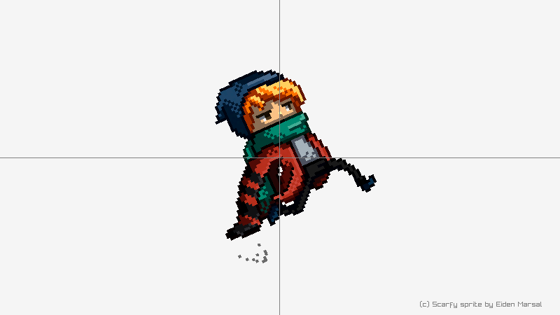 | ⭐⭐⭐☆ | 1.3 | 1.3 | [Ramon Santamaria](https://github.com/raysan5) |
| [textures_image_generation](textures/textures_image_generation.ex) | 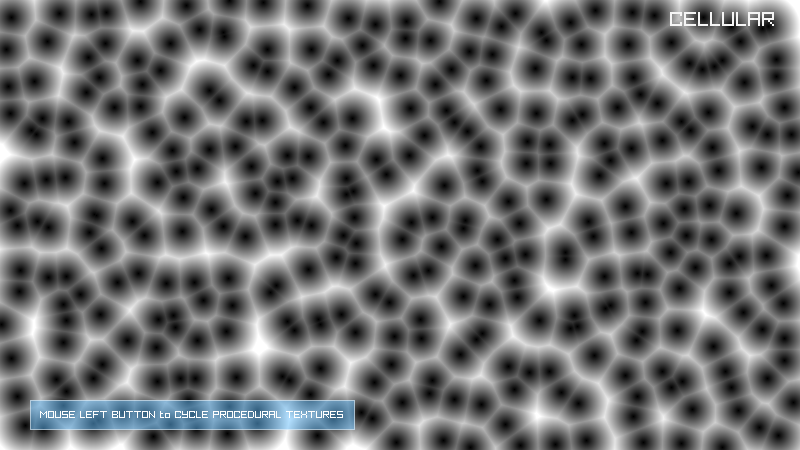 | ⭐⭐☆☆ | 1.8 | 1.8 | [Wilhem Barbier](https://github.com/nounoursheureux) |
| [textures_background_scrolling](textures/textures_background_scrolling.ex) | 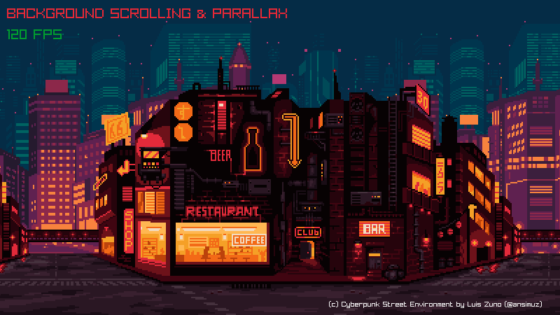 | ⭐☆☆☆ | 2.0 | 2.5 | [Ramon Santamaria](https://github.com/raysan5) |
| [textures_bunnymark](textures/textures_bunnymark.ex) | 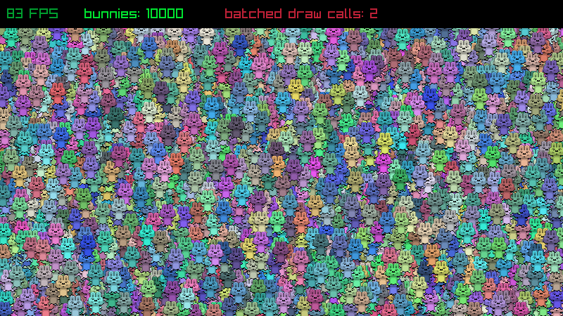 | ⭐⭐⭐☆ | 1.6 | 2.5 | [Ramon Santamaria](https://github.com/raysan5) |
| [textures_gif_player](textures/textures_gif_player.ex) | 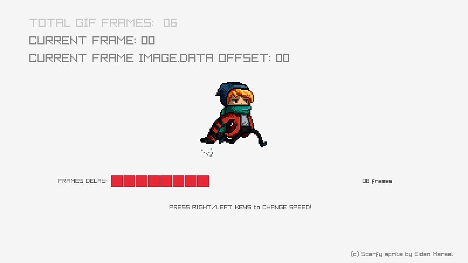 | ⭐⭐⭐☆ | 4.2 | 4.2 | [Ramon Santamaria](https://github.com/raysan5) |
| [textures_logo_raylib](textures/textures_logo_raylib.ex) | 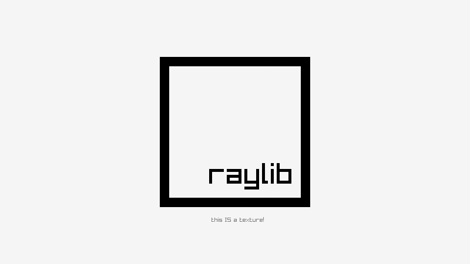 | ⭐☆☆☆ | 1.0 | 1.0 | [Ramon Santamaria](https://github.com/raysan5) |
### category: models [xx]

Examples using raylib models functionality, including models loading/generation and drawing, provided by raylib [models](../src/rmodels.c) module.

|  example  | image  | difficulty level | version created | last version updated | original developer |
|-----------|--------|:-------------------:|:------------------:|:-----------------------:|:----------------------|
[models_billboard_rendering](models/models_billboard_rendering.ex) | 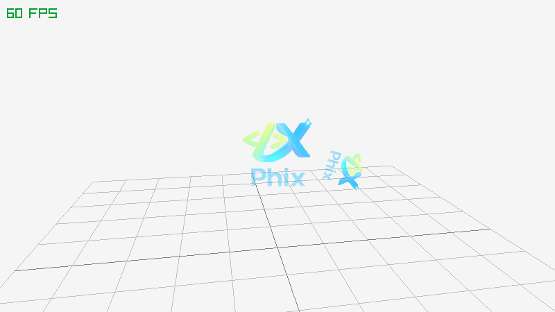 | ⭐⭐⭐☆ | 1.3 | 3.5 | [Ramon Santamaria](https://github.com/raysan5) |
| [models_directional_billboard](models/models_directional_billboard.ex) | 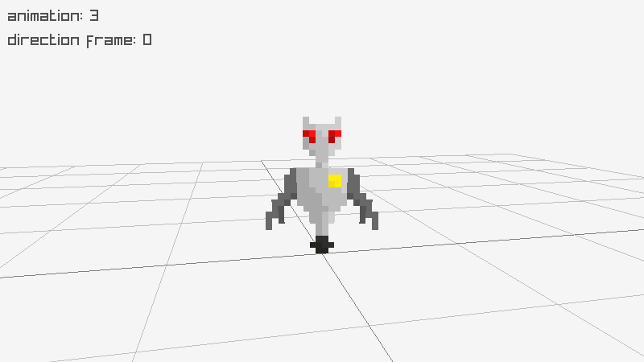 | ⭐⭐☆☆ | 5.6-dev | 5.6 | [Robin](https://github.com/RobinsAviary) |

### category: audio [xx]

Examples using raylib audio functionality, including sound/music loading and playing. This functionality is provided by raylib [raudio](../src/raudio.c) module. Note this module can be used standalone independently of raylib.

|  example  | image  | difficulty level | version created | last version updated | original developer |
|-----------|--------|:-------------------:|:------------------:|:-----------------------:|:----------------------|
| [audio_module_playing](audio/audio_module_playing.ex) | 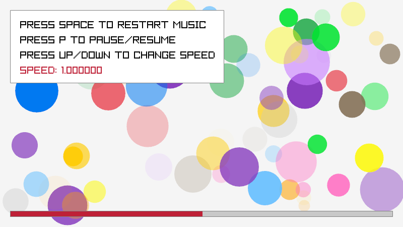 | ⭐☆☆☆ | 1.5 | 3.5 | [Ramon Santamaria](https://github.com/raysan5) |
| [audio_music_stream](audio/audio_music_stream.ex) | 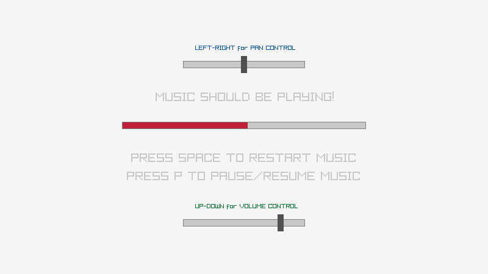 | ⭐☆☆☆ | 1.3 | 4.2 | [Ramon Santamaria](https://github.com/raysan5) |
| [audio_sound_multi](audio/audio_sound_multi.ex) | 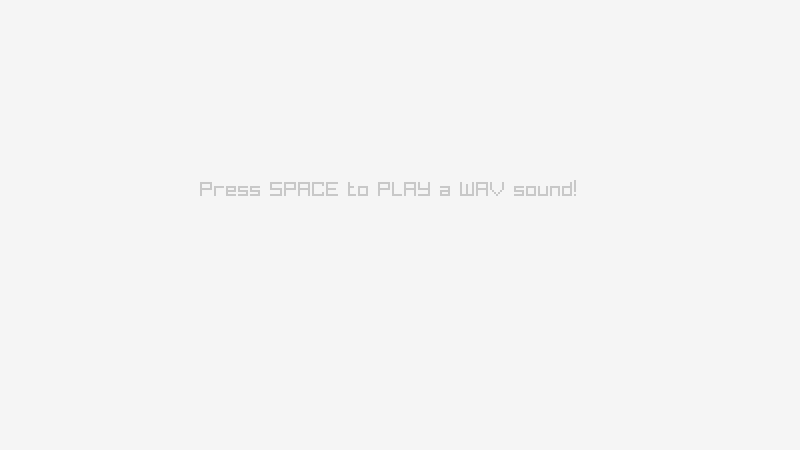 | ⭐⭐☆☆ | 5.0 | 5.0 | [Jeffery Myers](https://github.com/JeffM2501) |
| [audio_sound_positioning](audio/audio_sound_positioning.ex) | 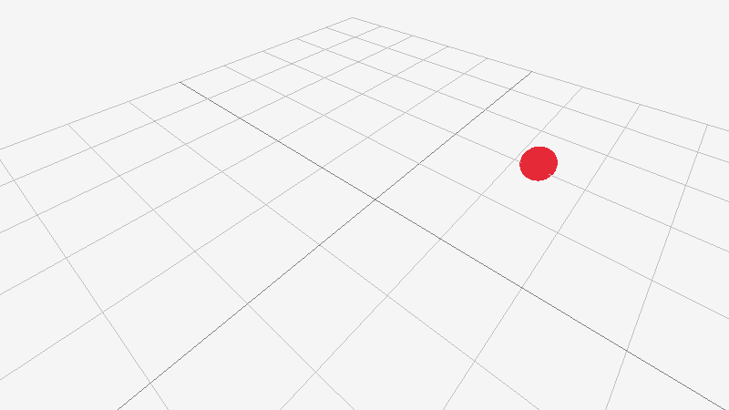 | ⭐⭐☆☆ | 5.5 | 5.5 | [Le Juez Victor](https://github.com/Bigfoot71) |
| [audio_sound_loading](audio/audio_sound_loading.ex) | 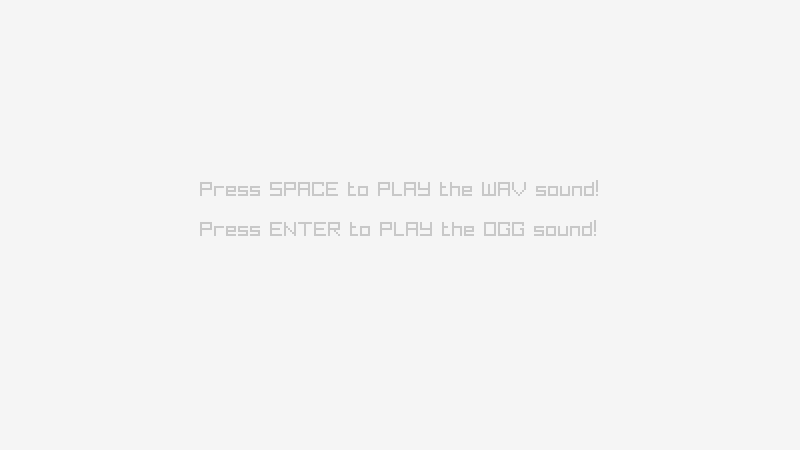 | ⭐☆☆☆ | 1.1 | 3.5 | [Ramon Santamaria](https://github.com/raysan5) |

### category: shaders [xx]

Examples using raylib shaders functionality, including shaders loading, parameters configuration and drawing using them (model shaders and postprocessing shaders). This functionality is directly provided by raylib [rlgl](../src/rlgl.c) module.

|  example  | image  | difficulty level | version created | last version updated | original developer |
|-----------|--------|:-------------------:|:------------------:|:-----------------------:|:----------------------|
| [shaders_shapes_textures](shaders/shaders_shapes_textures.ex) | 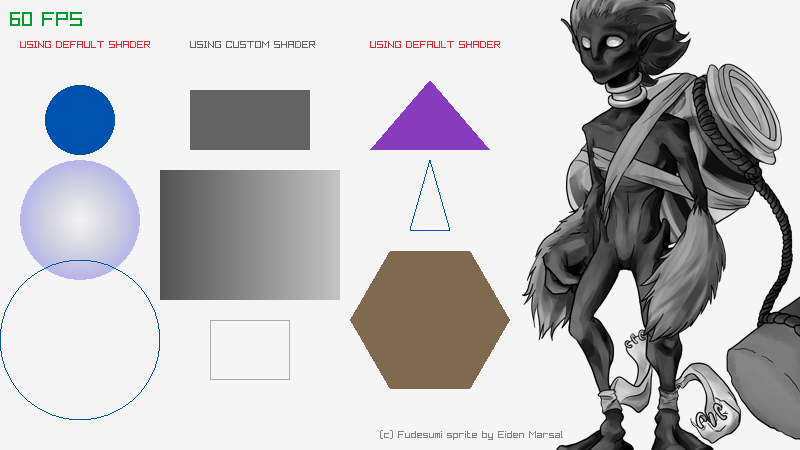 | ⭐⭐☆☆ | 1.7 | 3.7 | [Ramon Santamaria](https://github.com/raysan5) |
| [shaders_ascii_rendering](shaders/shaders_ascii_rendering.ex) | 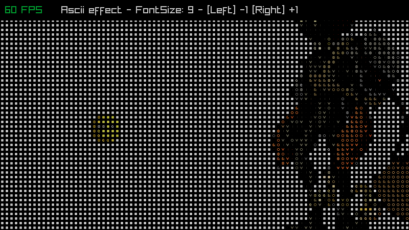 | ⭐⭐☆☆ | 5.5 | 5.6 | [Maicon Santana](https://github.com/maiconpintoabreu) |
| [shaders_color_correction](shaders/shaders_color_correction.ex) | 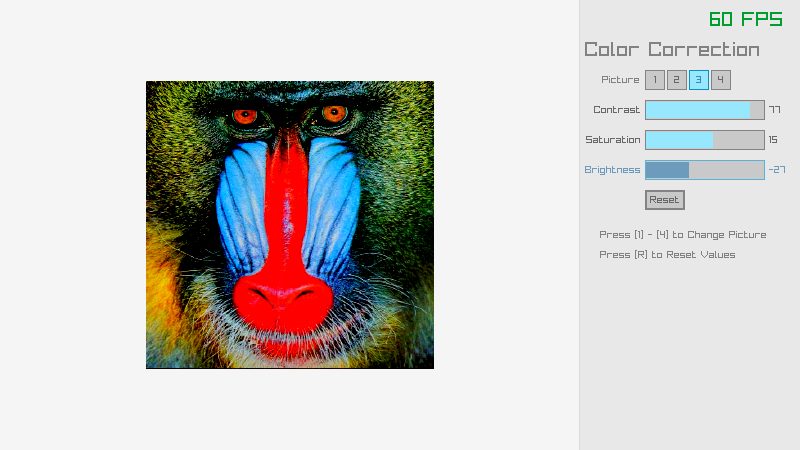 | ⭐⭐☆☆ | 5.6 | 5.6 | [Jordi Santonja](https://github.com/JordSant) |
| [shaders_multi_sample2d](shaders/shaders_multi_sample2d.ex) | 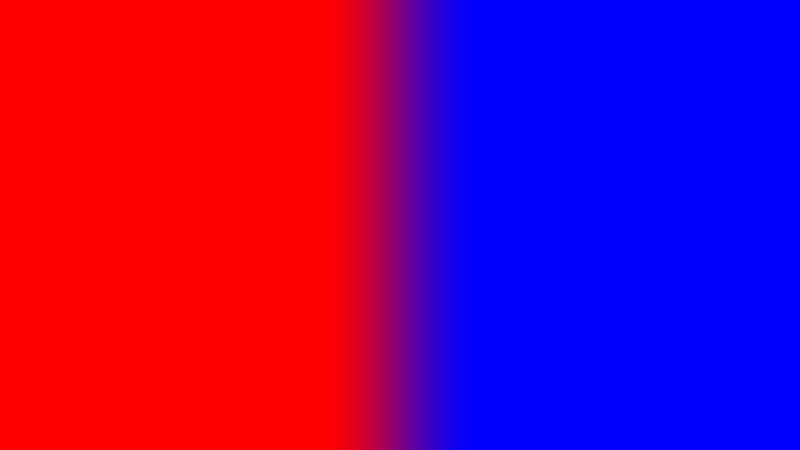 | ⭐⭐☆☆ | 3.5 | 3.5 | [Ramon Santamaria](https://github.com/raysan5) |
### category: text [xx]

Examples using raylib text functionality, including sprite fonts loading/generation and text drawing, provided by raylib [text](../src/rtext.c) module.

|  example  | image  | difficulty level | version created | last version updated | original developer |
|-----------|--------|:-------------------:|:------------------:|:-----------------------:|:----------------------|
| [text_font_spritefonts](text/text_font_spritefonts.ex) | 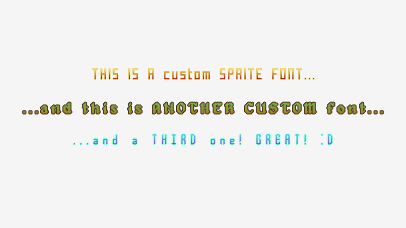 | ⭐☆☆☆ | 1.7 | 3.7 | [Ramon Santamaria](https://github.com/raysan5) |
| [text_font_loading](text/text_font_loading.ex) | 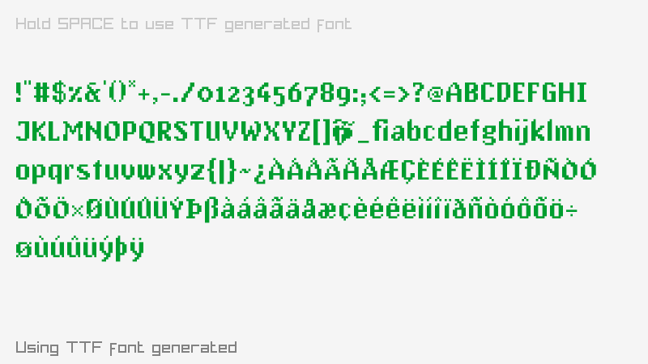 | ⭐☆☆☆ | 1.4 | 3.0 | [Ramon Santamaria](https://github.com/raysan5) |
| [text_writing_anim](text/text_writing_anim.ex) | 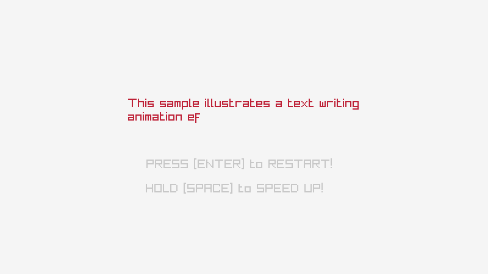 | ⭐⭐☆☆ | 1.4 | 1.4 | [Ramon Santamaria](https://github.com/raysan5) |